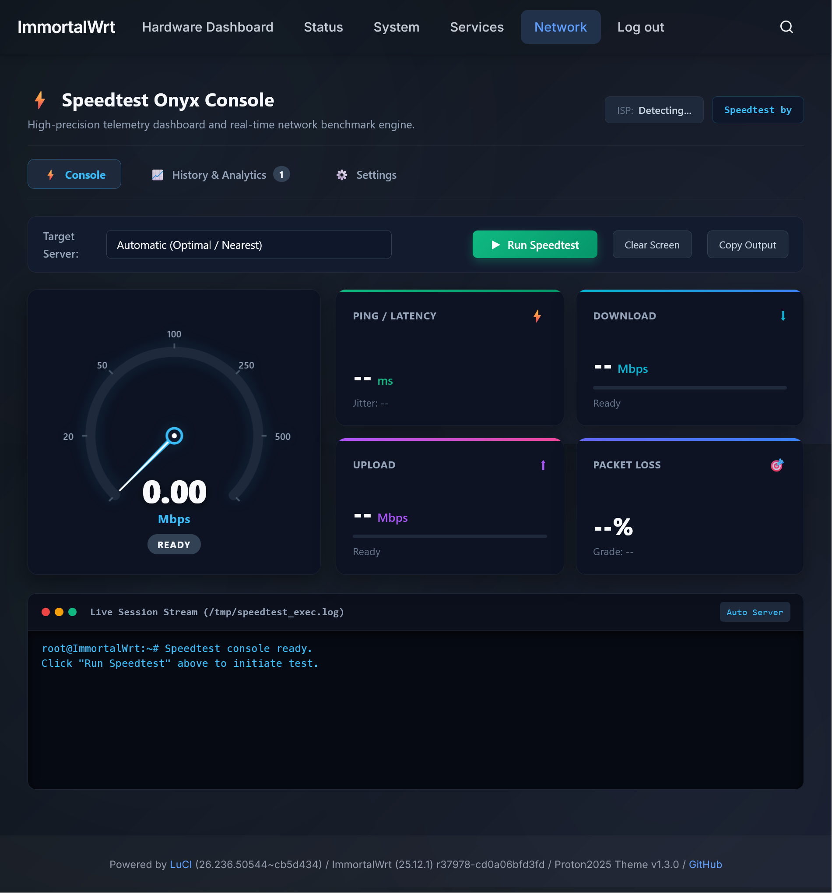
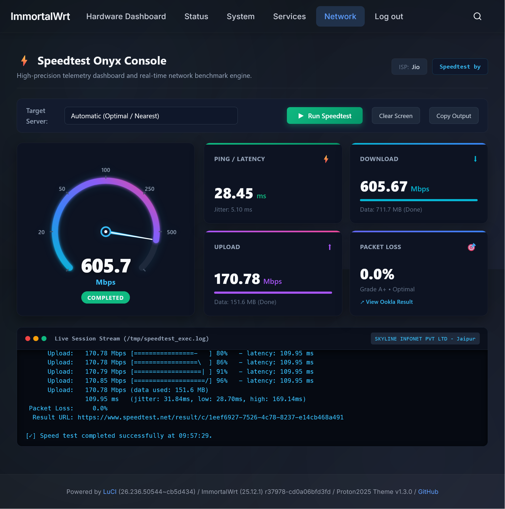
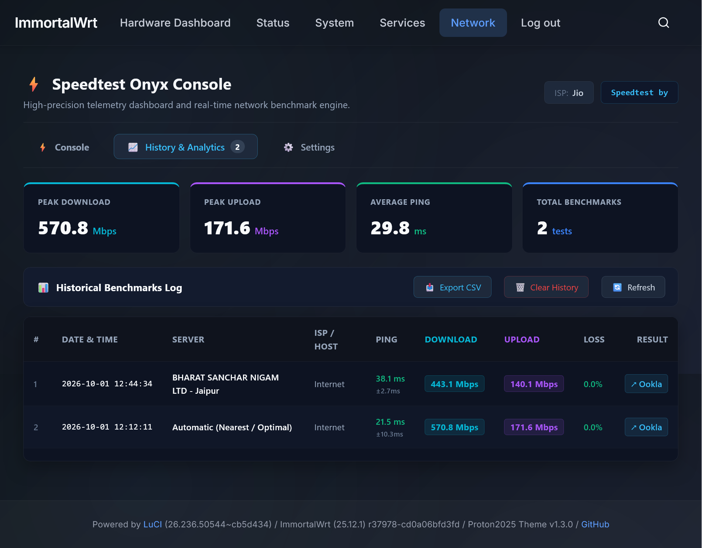
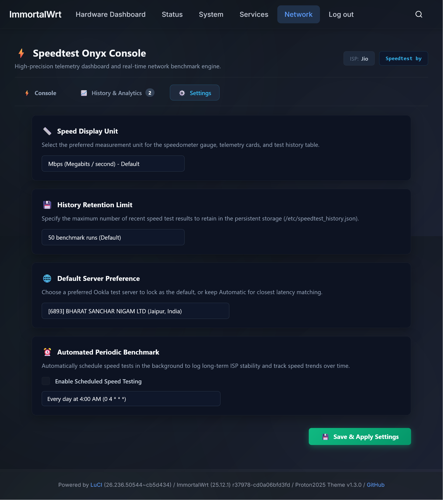

<div align="center">

# luci-app-speedtest-onyx

### Authentic Speedtest.net (Ookla) Onyx Dashboard for OpenWrt

[](https://github.com/MrManiesh/luci-app-speedtest-onyx/releases)
[-success.svg)](https://openwrt.org)
[](https://immortalwrt.org)
[](LICENSE)
[](#supported-architectures)

A modern, responsive LuCI web dashboard extension designed to run official **Speedtest.net (Ookla)** speed tests directly on your OpenWrt router, styled after the original Speedtest.net experience.

</div>

---

## 📸 Screenshots

| **Console Standby (Ready State)** | **Target Server Selection** |
| :---: | :---: |
| [](screenshot/before_speedtest_initial_state.png) | [](screenshot/Target_Server_selection.png) |
| *3-Tab layout, signature speedometer gauge, detected ISP & ready terminal* | *Automatic optimal server discovery or pick from nearby Ookla hosts* |

| **Active Benchmark & Full Telemetry (570+ Mbps)** | **Persistent History & Analytics** |
| :---: | :---: |
| [](screenshot/after_speedtest.png) | [](screenshot/History_and_analytics.png) |
| *High-speed bandwidth test, latency, jitter, packet loss & live streaming log* | *Peak DL/UL cards, comprehensive test log, direct Ookla links & CSV export* |

| **Dedicated Settings View** |
| :---: |
| [](screenshot/settings_page.png) |
| *Speed display units (Mbps, MB/s, Gbps), retention limit, default server lock & Cron scheduler* |

---

## ✨ Features

- **Automatic Theme-Adaptive Design System**: Seamlessly adapts and blends with **any OpenWrt theme** (LuCI default Bootstrap, Argon light/dark, Material, Aurora, Proton2025). Automatically detects theme background luminance and live theme changes to render Obsidian Dark or High-Contrast Crisp Light with zero manual configuration.


### 🎯 Authentic Speedtest.net Interface
- **The Signature "GO" Button**: Centerpiece idle screen with multi-ring radar pulse animations.
- **Dynamic Speedometer Gauge**: High-precision SVG tachometer arc (260° sweep) with real-time needle deflection and glowing progress trail.
- **Live Streamed Telemetry**: Watch download and upload bandwidth ramp up in real-time with sub-second responsiveness.
- **Complete Ookla Metric Suite**:
  - **Download Speed** (Mbps)
  - **Upload Speed** (Mbps)
  - **Ping / Latency** (Idle ms, Jitter ms)
  - **Packet Loss %**
  - **Client ISP & Public IP**
  - **Server Details** (Sponsor, City, Country, ID)
  - **Official Shareable URL** (`https://www.speedtest.net/result/c/...`)

### ⚡ Non-Blocking Telemetry Pipeline
- Standard LuCI RPC scripts often freeze or trigger `exec_failed` timeouts on long-running operations.
- `luci-app-speedtest` decouples execution:
  1. The test runner executes asynchronously in the background.
  2. Live progress events are streamed line-by-line into an atomic RAM cache (`/tmp/speedtest_state.json`).
  3. The LuCI JavaScript view polls status in **< 15ms**, ensuring smooth animations with **zero router UI lag**.

### 🛠️ 1-Click Binary Installer
- Detects router architecture (`x86_64`, `aarch64`, `armhf`, `i386`, `mips`) and automatically installs the appropriate engine:
  - **Tier 1 (Default)**: Official Ookla Speedtest CLI binary (`x86_64`, `aarch64`, `armhf`, `i386`).
  - **Tier 2 (MIPS Fallback)**: High-performance Go implementation (`speedtest-go`) for MIPS/MIPSEL routers.
- Direct 1-click install button right from the LuCI WebUI without requiring SSH access.

### 🌐 Server Selection
- Automatically selects the nearest, lowest-latency Ookla test server.
- Built-in "Change Server" dialog allows picking specific nearby servers.

### 📈 Persistent Test History & Analytics Table
- **Automated Logging**: Records every test run (Timestamp, Server, ISP, Ping/Jitter, DL/UL, Packet Loss, and Ookla Result link) to `/etc/speedtest_history.json`.
- **Analytics Metrics**: Glanceable summary cards for Peak Download, Peak Upload, Average Ping, and Total Tests.
- **Export to CSV**: 1-click CSV download for offline analysis and ISP performance logging.
- **Instant Table Purge**: Safe "Clear History" button with confirmation.

### ⚙️ Dedicated Settings Tab
- **Speed Display Unit Switcher**: Easily switch between **Mbps** (Megabits/sec), **MB/s** (Megabytes/sec - 1 MB/s = 8 Mbps), and **Gbps** (Gigabits/sec), dynamically adapting the gauge and cards.
- **History Retention Limit**: Configurable retention (25, 50, 100, 200 runs) with automatic storage trimming.
- **Default Server Locking**: Lock your preferred test server or keep automatic nearest server discovery.
- **Automated Periodic Benchmark**: Schedule tests via Cron with preset intervals (Daily 4:00 AM, 6 Hours, 12 Hours, Weekly) or custom expressions.

---

## 📁 Repository Structure

```
luci-app-speedtest/
├── Makefile                                       # Universal OpenWrt package Makefile
├── README.md                                      # Documentation & usage guide
├── root/
│   ├── etc/
│   │   ├── config/speedtest                       # UCI configuration
│   │   └── init.d/speedtest                       # Procd service & cron management
│   └── usr/
│       ├── libexec/
│       │   ├── speedtest-action.sh                # Fast RPC controller (<15ms)
│       │   ├── speedtest-runner.sh                # Async background worker streaming JSON
│       │   ├── speedtest-servers.sh               # Nearby Ookla servers provider
│       └── share/
│           ├── luci/menu.d/luci-app-speedtest-onyx.json # Menu entry: Onyx Tools -> Speed Test
│           └── rpcd/acl.d/luci-app-speedtest-onyx.json  # RPCD ACL security permissions
└── htdocs/
    └── luci-static/resources/view/speedtest/
        └── index.js                               # Modern client-side LuCI JavaScript view
```

---

## 🚀 Installation (OpenWrt 24.10+ & ImmortalWrt)

### Option 1: Direct 1-Line APK Install (Stable Release)
Run the following command over SSH on your router to install the latest stable version (**v1.5-r1**):

```sh
cd /tmp && uclient-fetch -O luci-app-speedtest-onyx-1.5-r1.apk https://github.com/MrManiesh/luci-app-speedtest-onyx/releases/download/v1.5-r1/luci-app-speedtest-onyx-1.5-r1.apk && apk add --allow-untrusted ./luci-app-speedtest-onyx-*.apk
```

### Option 2: Manual Installation via SCP
```sh
# Clone repository
git clone https://github.com/MrManiesh/luci-app-speedtest-onyx.git

# Copy files to router
scp -r root/* root@192.168.1.1:/
scp -r htdocs/* root@192.168.1.1/www/

# On router SSH:
chmod 0755 /usr/libexec/speedtest*
chmod 0755 /etc/init.d/speedtest
/etc/init.d/speedtest enable
/etc/init.d/speedtest start
/etc/init.d/rpcd reload
rm -rf /tmp/luci-indexcache /tmp/luci-modulecache
```

---

## 🗑️ Uninstallation

To remove the package:

```sh
apk del luci-app-speedtest-onyx
```

> [!TIP]
> ### Troubleshooting Uninstallation
> If you are trying to delete the package and encounter an error such as:
> `Unable to execute apk remove command: SyntaxError: JSON.parse: unexpected end of data at line 1 column 1 of the JSON data`
> (which happens on older builds if a process gets terminated during script execution), simply run the uninstall command skipping scripts:
> ```sh
> apk del --no-scripts luci-app-speedtest-onyx
> rm -rf /tmp/luci-indexcache /tmp/luci-modulecache
> /etc/init.d/rpcd reload
> ```

---

## ⚙️ Configuration

UCI options are stored in `/etc/config/speedtest`:

| Option | Type | Default | Description |
| :--- | :--- | :--- | :--- |
| `enabled` | boolean | `1` | Enable or disable the application |
| `server_id` | string | `""` | Target Ookla Server ID (`""` = auto best) |
| `unit` | string | `mbps` | Display units (`mbps`, `mbyte`, or `gbps`) |
| `history_max`| integer| `50` | Maximum history records to retain |
| `auto_test_enabled` | boolean | `0` | Enable automated periodic speed test |
| `auto_test_cron` | string | `0 4 * * *` | Cron schedule for automated tests |


---

## 🖥️ CLI Commands

You can also run diagnostics directly over SSH:

```sh
# Check engine status and architecture
/usr/libexec/speedtest-action.sh check

# Install or update Speedtest CLI engine
/usr/libexec/speedtest-action.sh install

# Trigger a speed test in background
/usr/libexec/speedtest-action.sh start

# Query live test status
/usr/libexec/speedtest-action.sh status

# Retrieve historical test records
/usr/libexec/speedtest-action.sh history

# Clear test history
/usr/libexec/speedtest-action.sh clear_history

# Cancel active speed test
/usr/libexec/speedtest-action.sh stop
```

---

## ⚠️ Disclaimer & Takedown Notice

> **IMPORTANT**: This project is developed strictly for **educational, testing, research, and personal hobbyist purposes**. 
> It is an independent open-source community extension and is **not** affiliated with, endorsed by, sponsored by, or officially associated with Ookla®, Speedtest.net, or any telecommunications carrier.
> 
> All trademarks, service marks, trade names, and brand names referenced in this repository (including Speedtest® and Ookla®) belong to their respective owners.
> 
> **Notice to Rights Holders**: If you believe that any file, asset, documentation, or code snippet in this repository infringes upon proprietary rights, contains confidential material, or should not be publicly hosted, please **open a GitHub Issue or contact the maintainer directly via Telegram**:
>
> 📬 **Telegram**: [t.me/Zeetron](https://t.me/Zeetron) (`@Zeetron`)

---

## 👤 Author & Developer Information

<div align="center">

| Role | Developer / Maintainer | Contact & Links |
|:---|:---|:---|
| 🚀 **Lead Developer & Maintainer** | **Manish Matwa Choudhary** | [](https://github.com/MrManiesh) [](https://t.me/Zeetron) |

</div>

---

## 📄 License

Licensed under the Apache License 2.0. See [LICENSE](LICENSE) for details.
